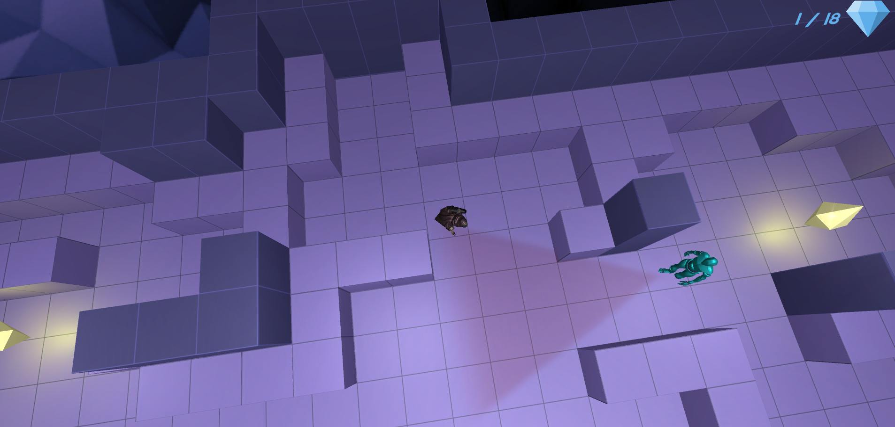

# School project for Advanced Game Design course

Players goal is to collect all diamonds located on the map, he should also avoid the NPC that are patrolling the map.

When player enters the NPC sight he timer starts, NPC is pointing his gun in players direction.
After the timer is passed NPC takes the shot and kills player. Player needs to restart the level.
If player leaves the NPCs sight, NPC goes to where the player was last seen and looks around. If he can't find him he goes back to patroling. 

Main focus was put on programming and AI aspects, that's why there is only 1 level. It was enough for testing purposes.

Character models and animations comes from mixamo.com
